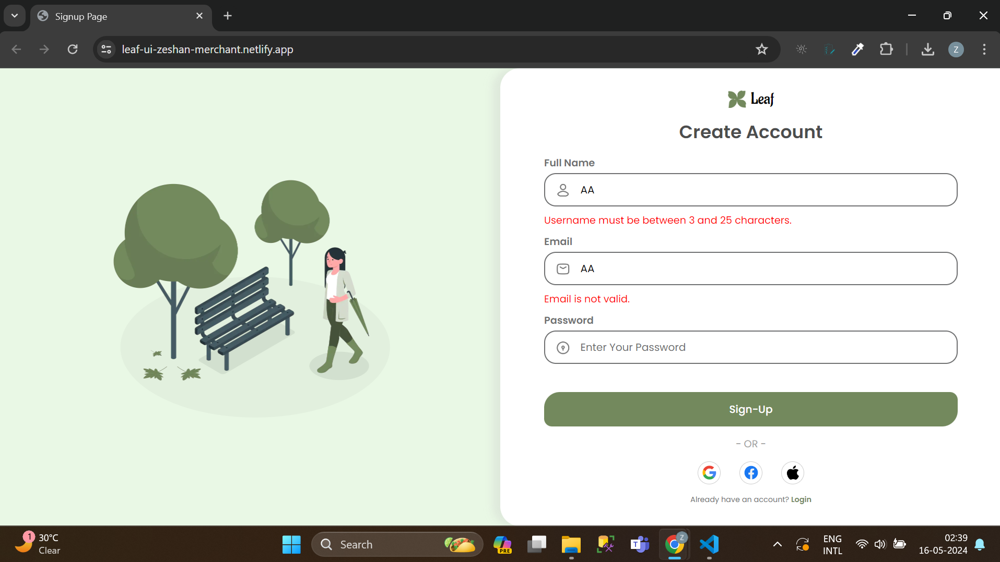

# Leaf-UI-Challenge Repository

## Description
This repository contains the solution for the Leaf UI Challenge, an internship assignment focused on creating a signup form using Figma UI design. The signup form is designed to be responsive, supporting both desktop and mobile devices. Additionally, client-side validation has been implemented to prevent the submission of empty input fields and check for invalid usernames or emails.

## Screenshots
### Desktop View

### Mobile View

## Technologies Used
- HTML
- CSS
- JavaScript

## Features
- Responsive design for desktop and mobile devices.
- Client-side validation to prevent submission of empty input fields and check for invalid usernames or emails.

## License
This project is licensed under the MIT License - see the [LICENSE](/path/to/LICENSE) file for details.
